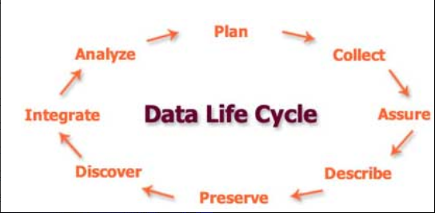

Date: 24 October 2018

Author: Michael McGrath

Editor:

Reviewers: Ebby John

>   Imran Khan

>   Javier Lopez

>   Katie Reay

>   Lisha Tan

>   Sean O’Brien

Version History
===============

12 OCT ’18 V0.0 First draft, not for review

24 OCT ’18 V0.1 Review candidate for editing

XX XXX ’18 V0.2 Review candidate for review panel

XX XXX ’18 V1.0 For publication

List of figures
===============

[Figure 1 Original Data Lifecycle Model (ODLM) 6](#_Toc528129122)

[Figure 2 DLM as presented by Lenhardt et al., 2014 9](#_Toc528129123)

[Figure 3 DLM as presented by Spirion 11](#_Toc528129124)

[Figure 4 ITTStar DLM 12](#_Toc528129125)

[Figure 5 Data Lifecycle Model (DLM) 19](#_Toc528129126)

List of Tables
==============

[Table 1 ODLM mapped to Texas A&M Model 7](#_Toc528129130)

[Table 2 ODLM Mapped to RAMP Model 8](#_Toc528129131)

[Table 3 ODLM Mapped to Bloomberg Model 10](#_Toc528129132)

[Table 4 ODLM Mapped to Spirion Model 11](#_Toc528129133)

[Table 5 ODLM Mapped to ITTStar Model 12](#_Toc528129134)

[Table 6 Data Lifecycle Model 14](#_Toc528129135)

[Table 7 Cross data lifecycle activities 18](#_Toc528129136)

Introduction
============

This paper is the output from the first Seahorse project. The goal of this
project is to define a working and robust data lifecycle model. This paper
describes the first Seahorse project. The goal of this project is to define a
working data lifecycle model (DLM) that is practical in use and is as complete
as possible. The DLM is based of the Initial data lifecycle model, described
below.

The growing role of data.
-------------------------

The growth in data is exceptional. While estimated of just how much data exists
vary all estimates show the same trend, exponential growth. Khoso (Khoso, 2016)
estimates that data in 2016 totalled around 4.4 Zetabytes[^1] and that that
would grow to ten times that by 2020. Even email is growing by over 4% per year
(Radicati and Hoang, 2017). In tandem with the growth in data there is a
corresponding growth in storage required to persist that data. Additionally, we
see that the majority of that data is in unstructured forms; Khoso (Khoso, 2016)
estimates that about 90% of data created is unstructured, this view is supported
by practitioners (V Cloud News, 2015) who also asserted that 90% has been
created in the last year.

[^1]: The zettabyte is a multiple of the
unit [byte](https://en.wikipedia.org/wiki/Byte) for [digital
information](https://en.wikipedia.org/wiki/Computer_data_storage).
The [prefix](https://en.wikipedia.org/wiki/SI_prefix) [zetta](https://en.wikipedia.org/wiki/Zetta-) indicates
multiplication by the seventh power of 1000 or 1021 in the [International System
of Units](https://en.wikipedia.org/wiki/International_System_of_Units) (SI). A
zettabyte is one sextillion bytes. The unit symbol is ZB. 1 ZB
= 10007bytes = 1021bytes = 1000000000000000000000bytes.

    A related unit,
    the [zebibyte](https://en.wikipedia.org/wiki/Zebibyte) (ZiB), using
    a [binary prefix](https://en.wikipedia.org/wiki/Binary_prefix), is equal
    to 10247 (=270) bytes (approximately 1.181 ZB).(Source:
    <https://en.wikipedia.org/wiki/Zettabyte>)

There is also great value to this data, for example a report by focusing on data
in the automotive industry suggests that *“The expected growth of the value pool
from car data and shared mobility could add up to more than USD 1.5 trillion by
2030”* (Balasubramanian *et al.*, 2016) and that this data used in AI *“… could
potentially deliver additional economic output of around \$13 trillion by 2030,
boosting global GDP by about 1.2 percent a year”* (*Modeling the global economic
impact of AI \| McKinsey*, no date).

In addition, some practitioners have reported other problems most notably that
there are no common data formats, little metadata and little interoperability
because the systems exist in independent and distinct systems (Sohn, 2017). It
is even asserted that these issues place such a financial burden on the health
industry as to be a noteworthy contributor to rising costs (Wang, Kung and Byrd,
2018).

The DLM is important because it will provide the basis for the next project
which will describe an objective method and model to identify the total
lifecycle cost and value of data.

The goal of this project is to define a robust data lifecycle model (DLM) for
future research to be based upon. In addition, the goal of the DLM is to provide
a “language” to describe the state of data at anytime. The model assumes that
says can exist in multiple states, simultaneously, for example it can be stored
and indexed at the same time.

“The goal of a data management lifecycle is to ensure that … data are collected
with enough rigor to support the intended use, to support basic data management,
to enable reuse and repurposing of the data, and to allow for the eventual
long-term preservation and management of the data.” (Lenhardt *et al.*, 2014).
An additional goal of this particular model is to provide the basis for the
second research project which will investigate the total cost of data ownership
and the corresponding value of that data. The project will aim to deliver an
objective and repeatable financial model for both cost and value.

Methodology
-----------

The method used is straightforward. Starting with the original data lifecycle
model(ODLM), which I had previously developed a search of contemporary research
papers and practitioner publications were gathered and reviewed. Where there
were gaps or differences identified these were evaluated and the original DLM
was modified or not, accordingly.

Figure 1 Original Data Lifecycle Model (ODLM)

Documentation reviewed
======================

This section describes the literature reviewed. As mentioned previously the
review is to include practitioner publications as such the review conducted is
slightly wider in scope of material covered that a “traditional academic”
literature review including practitioner models which are often published in
books or web pages. As stated earlier, the goal of this project is to create a
complete model for the data lifecycle which is robust enough to be applicable in
any circumstance. By complete, that is to say the model should not miss any
lifecycle stages. Some of the models examined here such as the DCC (Higgins,
2008) are designed to address specific purposes and therefore have too narrow a
focus for the purposes of this research. That said, these are still examined
because there may be elements within them that are useful additions to the
original model.

The Texas A&M Transportation Institute (Miller *et al.*, 2018) identifies seven
major stages in the data lifecycle this model has a number of differences from
the ODLM. The most significant are it separates storage from archiving, this is
something that other models do also. However, in the model we keep these
together for a number of reasons, the two most significant are that firstly
archival storage, even compliant storage such as 17a-4 (Securities and Exchange
Commission, 2003) compliant storage is nonetheless storage. The second reason is
that as the cost and capability of storage improves (i.e. decreases) in line
with “Moore’s Law” (Moore, 2007) we see a growing desire to consume longitudinal
data “in place” from within the archive. Thus, over time, the boundary between
life or active data and archival data is blurring. This is obviously an
ontological position of the author and his colleagues at this juncture.

These stages can be broadly mapped to the original model as follows:

Table 1 ODLM mapped to Texas A&M Model

| **Original Model** | **Texas A&M model**                    |
|--------------------|----------------------------------------|
| Create             |                                        |
| Control            | Collection Process                     |
| Store              | Store & Secure[^2]                     |
| Index              |                                        |
| Consume            | Use Share and communicate              |
| Dispose            | Destroy or re-use (concurrent phases). |

[^2]: Secure addresses may topics. In the ODLM these happen in different places,
encryption is part of the control activity, while other security happens as part
of the cross lifecycle activities.

The Texs A&M paper also explores other related aspects of data lifecycle
management which re worthy of note:

-   Purpose and value

-   Privacy

-   Data ownership

-   Liability

-   Public perception

-   Security

-   Standards and Data Quality

These topics are out of scope for this particular project, but they will be
examined in later research.

A similar DLM is found in a description of the Research Data Management Platform
(RDMP) (Nind *et al.*, 2018) which is a longitudinal research dataset. They
found similar stages to the ODM, which are Create, Process, Analyse, Presenting,
Give access (reuse). These map fairly closely as can be seen in the table,
below:

Table 2 ODLM Mapped to RAMP Model

| **Original Model** | **RDMP Model**           |
|--------------------|--------------------------|
| Create             | Create                   |
| Control            | Process                  |
| Store              |                          |
| Index              |                          |
| Consume            | Presenting & Give access |
| Dispose            |                          |

In a web publication entitled “Data Management Lifecycle and Software Lifecycle
Management in the Context of Conducting Science” (Lenhardt *et al.*, 2014)
published a DLM with some interesting additional features. The model is shown
below:

Figure 2 DLM as presented by Lenhardt et al., 2014

This model call for DLM to have additional elements of assure and describe.
Assure is part of the ODLM as part of the end to end lifecycle verification and
validation. Describe exists also as enrichment but will be added going forward.

The final DLM related paper that was reviewed was a review of eight models by
Alex Ball (Ball, 2012). In it he reviews eight DLMs which are specifically
focused on scientific data and as such display elements that are specific to
that purpose. As such they tend toward a degree of functional specificity that
is too granular for our purposes. That said, there are noteworthy element to
consider. Ball’s paper covered the following DLMs of which two were of
particular interest:

1.  DCC Curation Lifecycle

2.  I2S2 Idealized Scientific Research Activity Lifecycle Model

3.  DDI Combined Life Cycle Model

4.  ANDS Data Sharing Verbs

5.  DataONE Data Lifecycle

6.  UK Data Archive Data Lifecycle

7.  Research360 Institutional Research Lifecycle

8.  Capability Maturity Model for Scientific Data Management

The first model of interest is the Data Documentation Initiative (DDI) (*Data
Documentation Initiative*, no date) lifecycle. Like others, it is limited for
our purposes because of its focus on surveys. It is useful as a subset of a DLM
because of its incorporation of reuse and different versions. The idea of reuse
and versioning is introduced in the DDI mode and important one. It begs the
question how this should be addressed in our reference model for the data
lifecycle. After some consideration, I decided that every time a new copy or
instance of piece of data is created that is the start of a new data lifecycle
for that new instance of data. Creating a new version of the data through
modelling the data does not represent a new data lifecycle starting. In the end
I decided to take view that each item of data has its own lifecycle and thus
when data is modified or copied it is starting a new life cycle.

The UK Data Archive Data Lifecycle (UK Data Service, no date) provided very
useful definitions which have been incorporated into the definitions of the
modified model described in the following cycle.

Two practitioner developed models of note are presented by Bloomberg (Bloomberg
Professional Services, 2015), Spirion (Spirion, no date) and ITTStar (ITT Star,
2018).

Bloomberg’s model is composed of seven steps which can be mapped as follows:

Table 3 ODLM Mapped to Bloomberg Model

| **Original Model** | **Bloomberg model**                           |
|--------------------|-----------------------------------------------|
| Create             |                                               |
| Control            | Data Maintenance & Data Capture               |
| Store              | Data Archival                                 |
| Index              | Data Synthesis, Data Usage & Data Publication |
| Consume            |                                               |
| Dispose            | Data purging                                  |

The model put forward by Spirion is similar. It is shown in the figure, below.
Whereas the ODLM has consumption, the act of using the data and therefore
deriving value from the data, they describe it a share which opens up the wider
possibility of publishing or sharing.

Figure 3 DLM as presented by Spirion

This maps closely to the ODLM, which can be seen in the following table:

Table 4 ODLM Mapped to Spirion Model

| **Original Model** | **Spirion model** |
|--------------------|-------------------|
| Create             | Create            |
| Control            |                   |
| Store              | Store Archive     |
| Index              |                   |
| Consume            | Share             |
| Dispose            | Destroy           |

The final practitioner model examined was one produced by ITTStars. It
highlights the useful features examining the need for data clean-up within the
control phase which the ODLM does not present. Again, like others it also draws
attention to data description and analysis. They, ITTStars, present it using the
following figure:

Figure 4 ITTStar DLM

For comparison with the ODLM we can see a high degree of overlap, indicated by
the table below:

Table 5 ODLM Mapped to ITTStar Model

| **Original Model** | **ITTStar model**          |
|--------------------|----------------------------|
|                    | Purpose                    |
| Create             | Collect, Create & Describe |
| Control            |                            |
| Store              | Preserve                   |
| Index              |                            |
| Consume            | Analyze & Public Share     |
| Dispose            |                            |

Changes to the original data lifecycle model arising from the literature
========================================================================

This section describes the changes to the original data model resulting from the
literature review. The following section “Modified model” describes the modified
data model and contains a definition of each stage and corresponding activities
in that phase.

By looking at the mapping of the ODLM and the various model presented it is
clear that, at a high level, there are no gaps in the ODLM, with the possible
exception of Purpose from ITTStar model. Purpose is essentially the intended use
of the data and predates the data’s creation. It follows that it is part of its
lifecycle. For a dataset identification of its purpose can indicate it's
intended use and intended value. For this reason, I propose to add it to the
lifecycle.

There are two other concepts of data that are given prominence in the preceding
models. These are reuse or repurposing and publication.

The act of reusing data, even if for an entirely different purpose opens up all
sorts of questions about the value and use of the data being used and
interpreted correctly. This is an aspect of data consumption which will need
further consideration. As such, it will be added as part of consumption.

Publication is more problematic; once data is published it is no longer
controlled and may even be duplicated. Equally we can’t assume that the data is
ever going to be deleted. Therefore, the mode will assume that published data is
a new data lifecycle in its own right. This implies that the publication of the
data is outside of the controlled lifecycle. This is intentional, publication
within the lifecycle is another form of consumption, making the data available
to a new population of human and machine data consumers

Changes to the horizontal component of the model
------------------------------------------------

The ODLM has a horizontal component that represents the activities that exist
through the lifecycle of the data. This was originally defined as being composed
of three components:

-   Tracking

-   Service

-   Security

To this list the horizontal or cross lifecycle components are expanded to
include:

-   Retention

-   Hold

-   Disposition

-   Temporal immutability

-   Data object lifecycle tracking and reporting

-   Data object activity tracking and reporting

-   Security

-   Data object content verification

With the addition of these two steps the high-level data lifecycle model is
represented as:

-   Purpose

-   Create

-   Control

-   Store

-   Index

-   Consume

-   Publish

-   Dispose

Needless to say while some of these steps happen in sequence, such as Propose
must come before Create, others can happen in parallel, such as Store and Index
and other in reverse order, such as consumption may lead to the date being
modified and restored.

Definition of the model
-----------------------

This section presents the latest version of the DLM with in more detail,
highlighting the typical activities that occur in each stage and providing a
definition of the activity. Each stage has one or more activities associated
with it. Each stage will be presented as the stage the activities and a
definition of the activity. Where the definitions are tasked directly from
another source, that source will be referenced

Table 6 Data Lifecycle Model

| **Purpose**           |                                                                                                                                                                                                                                                                                                                                                      |
|-----------------------|------------------------------------------------------------------------------------------------------------------------------------------------------------------------------------------------------------------------------------------------------------------------------------------------------------------------------------------------------|
| Setting purpose       | Defining and stating the purpose for the data object to be collected or created. This may be extended to include data definition and format data.                                                                                                                                                                                                    |
| Preservation planning | *Strategies, policies and procedures for all curation actions* (Ball, 2012, pg. 3) This should include the approach and policies relating to data retention and disposition (deletion).                                                                                                                                                              |
| **Create**            |                                                                                                                                                                                                                                                                                                                                                      |
| Creation              | Creation of a new data object either by human content creation, human entry of data or by automatic means.                                                                                                                                                                                                                                           |
| Modification          | Modification of existing data object resulting in a new data record being created.                                                                                                                                                                                                                                                                   |
| Duplication           | Duplicating of an existing data record. This results in a new copy of the data object being created which has its own data lifecycle.                                                                                                                                                                                                                |
| **Control**           |                                                                                                                                                                                                                                                                                                                                                      |
| Capture               | Capturing the data object and associate meta data                                                                                                                                                                                                                                                                                                    |
| Direction             | Ensuring that data is sent to the correct repository or repositories and that it is indexed accordingly.                                                                                                                                                                                                                                             |
| Encryption            | Encrypting the data object                                                                                                                                                                                                                                                                                                                           |
| Validation            | Ensuring the data object is complete and fit for purpose within either defined standards or acceptable norms. The goal is to ensure the data quality and integrity across it's lifecycle. This is also necessary to support the cross lifecycle task of data object content verification.                                                            |
| Enriching             | Addition of meta data about the data object or its contents. This might include:                                                                                                                                                                                                                                                                     |
| Describing            | A computer-generated description of the data object                                                                                                                                                                                                                                                                                                  |
| Transformation        | Performing operations to transform the data object and or its meta data.                                                                                                                                                                                                                                                                             |
| **Store**             |                                                                                                                                                                                                                                                                                                                                                      |
| Storing               | Locating the data object into an operational storage location or locations                                                                                                                                                                                                                                                                           |
| Archiving             | Locating the data object into an archival storage location or locations                                                                                                                                                                                                                                                                              |
| Index                 |                                                                                                                                                                                                                                                                                                                                                      |
| Indexing              | Indexing the data object. This makes it possible to search for the object and for it to be processed. The data object is this accessible via the index. The index may or may not store the object’s meta data and enrichments.                                                                                                                       |
| **Consumption**       |                                                                                                                                                                                                                                                                                                                                                      |
| Read                  | Accessing either the data object and/or the data object’s meta data from or via the index.                                                                                                                                                                                                                                                           |
| Process               | Performing some type of process using the data object and or it’s meta data. This may result in the creation of a new data object or modification of the existing data object.                                                                                                                                                                       |
| Analytics             | Preforming an analytical operation or set of operations using the data object and/or it’s meta data. This may result in the creation of a new data object or the modification of the existing data object.                                                                                                                                           |
| Modification          | Modification the data object, its index or meta data. This results in the modification of the existing data object.                                                                                                                                                                                                                                  |
| Export                | Creating a data record outside of the control of the data system. If the data object is placed outside of the control of the lifecycle it is effectively published.                                                                                                                                                                                  |
| Reuse                 | Using for data object and/or it’s meta data for a purpose for which it wasn’t intended.                                                                                                                                                                                                                                                              |
| **Publishing**        |                                                                                                                                                                                                                                                                                                                                                      |
| Publishing            | Making data objects and/or their meta data available outside of the controlled data lifecycle. It does not necessarily mean the data is placed in the public domain. This is assumed to represent data duplication and the data objects should be assumed to persist indefinitely.                                                                   |
| **Disposition**       |                                                                                                                                                                                                                                                                                                                                                      |
| Deletion              | Deletin represents the deletion of data. In practice this might be achieved by removing the data from the index, thus making the data no longer searchable, reallocating the storage or writing over the data to make it forensically difficult to retrieve.                                                                                         |
| Data destruction      | Deletion of all instances of the data object and possible it’s meta data. To be controlled it should be performed as part of a retention & disposition policy framework. Disposition may also describe or require the nature of data destruction which can include removal of the index, over writing the data or destruction of the storage medium. |

-   Stamping meta data such as date, location or time

-   Extracting meta data such a converting voice to text

-   Additional data to describe the data object

-   Additional date to describe content within the data object

-   Analysis and creation of meta data to support later analytical or
    exploratory purposes.

The following table describes the items that compose the cross life-cycle
stages. These are what we understand to be necessary best practice activities.

Table 7 Cross data lifecycle activities

| **Cross data lifecycle activities**          |                                                                                                                                                                                                                                                       |
|----------------------------------------------|-------------------------------------------------------------------------------------------------------------------------------------------------------------------------------------------------------------------------------------------------------|
| Retention                                    | Policies and mechanisms in place to ensure that data objects and meta data or not destroyed or removed whiles they are still required                                                                                                                 |
| Hold                                         | A specific mechanism to ensure data is retained, in addition to the retention policies.                                                                                                                                                               |
| Disposition                                  | A mechanism and policies to ensure data is removed or destroyed at the appropriate time. Best practice is that disposition policies take lower precedence than hold or retention. As such data that is under hold or retained can not be disposed of. |
| Temporal immutability                        | The ability to make a data object or its metadata immutable for a defined period of time, typically in line with retention policy.                                                                                                                    |
| Data object lifecycle tracking and reporting | Tracking the lifecycle events that occur to data objects. Reporting and other monitoring based on this is also included.                                                                                                                              |
| Data object activity tracking and reporting  | Tracking the activities that impact the data object or metadata. These include activities such as searching, viewing and publishing the data object.                                                                                                  |
| Security                                     | The provision of information security practice in line with best practice.                                                                                                                                                                            |
| Data object content verification             | Verificatin and validation od the data object’s content.                                                                                                                                                                                              |

Combined this presents a data lifecycle model that can be visualized as follows:

Figure 5 Data Lifecycle Model (DLM)

Conclusion
==========

The review of this topic has been sufficient for the intended purpose, but I
recognize it is cursory in nature and further research would be valuable. That
said, the sample of literature surveyed suggests that the body of research to
date has been focused on research practices in academic contexts and not the
practice in the public or private sector. Further academic research in these
sectors would be valuable.

In spite of the shortcomings of the research the model produced is sufficient to
conduct the next stage of research which is to define a model for data lifecycle
cost modelling and data lifecycle value modelling.

Bibliography
============

Balasubramanian, J. *et al.* (2016) ‘Car data: paving the way to value-creating
mobility’, *McKinsey & Company*, (March). Available at:
https://www.mckinsey.com/\~/media/McKinsey/Industries/Automotive and
Assembly/Our Insights/Creating value from car data/Creating value from car
data.ashx (Accessed: 10 September 2018).

Ball, A. (2012) ‘Review of Data Management Lifecycle Models.’, p. 15. Available
at:
https://purehost.bath.ac.uk/ws/portalfiles/portal/206543/redm1rep120110ab10.pdf
(Accessed: 8 September 2018).

Bloomberg Professional Services (2015) *7 phases of a data life cycle \|
Bloomberg Professional Services*, *Bloomberg*. Available at:
https://www.bloomberg.com/professional/blog/7-phases-of-a-data-life-cycle/
(Accessed: 16 July 2018).

V Cloud News (2015) *Every day Big Data Statistics - 2.5 Quintillion Bytes of
Data Created Daily*, *Vcloudnews*. Available at:
http://www.vcloudnews.com/every-day-big-data-statistics-2-5-quintillion-bytes-of-data-created-daily/
(Accessed: 20 August 2017).

*Data Documentation Initiative* (no date). Available at:
http://www.ddialliance.org/ (Accessed: 6 October 2018).

Higgins, S. (2008) ‘The DCC Curation Lifecycle Model’, *International Journal of
Digital Curation*, 3(1), pp. 134–140. doi: 10.2218/ijdc.v3i1.48.

ITT Star (2018) *IT Datamanagement \| ITTStar Consulting LLC*. Available at:
http://www.ittstar.com/it_data.html (Accessed: 6 October 2018).

Khoso, M. (2016) *How Much Data is Produced Every Day?*, *Level Blog -
Northeastern University*. Available at:
http://www.northeastern.edu/levelblog/2016/05/13/how-much-data-produced-every-day/
(Accessed: 20 August 2017).

Lenhardt, W. *et al.* (2014) ‘Data Management Lifecycle and Software Lifecycle
Management in the Context of Conducting Science’, *Journal of Open Research
Software*. Ubiquity Press, 2(1), p. e15. doi: 10.5334/jors.ax.

Miller, K. *et al.* (2018) ‘Data Management Life Cycle, Final report’. Available
at: https://static.tti.tamu.edu/tti.tamu.edu/documents/PRC-17-84-F.pdf
(Accessed: 8 September 2018).

*Modeling the global economic impact of AI \| McKinsey* (no date). Available at:
https://www.mckinsey.com/featured-insights/artificial-intelligence/notes-from-the-ai-frontier-modeling-the-impact-of-ai-on-the-world-economy
(Accessed: 24 September 2018).

Moore, G. E. (2007) ‘David C. Brock(Editor). Understanding Moore’s Law: Four
Decades of Innovation . x + 160 pp., illus., notes, index. Philadelphia:
Chemical Heritage Foundation, 2006. \$12 (paper).’, *Isis*. Philadelphia, Pa:
Chemical Heritage Foundation, 98(4), pp. 887–887. doi: 10.1086/529346.

Nind, T. *et al.* (2018) ‘The research data management platform (RDMP): A novel,
process driven, open-source tool for the management of longitudinal cohorts of
clinical data’, *GigaScience*. Oxford University Press. doi:
10.1093/gigascience/giy060.

Radicati, S. and Hoang, Q. (2017) *Email Statistics Report, 2017-2021*, *Email
Statistics report, 2017-2021 - Executive Summary*. London. Available at:
http://www.radicati.com (Accessed: 1 October 2018).

Securities and Exchange Commission (2003) *Interpretive Release: Electronic
Storage of Broker-Dealer Records; Rel. No. 34-47806*. Available at:
https://www.sec.gov/rules/interp/34-47806.htm (Accessed: 24 October 2018).

Sohn, A. (2017) *You Want to do What With Your Data?* Available at:
https://bigdata.cioreview.com/cxoinsight/you-want-to-do-what-with-your-data-nid-27091-cid-15.html
(Accessed: 8 September 2018).

Spirion (no date) *Data Lifecycle Management (DLM) \| Spirion*, *Spirion*.
Available at: https://www.spirion.com/data-lifecycle-management/ (Accessed: 6
October 2018).

UK Data Service (no date) *UK Data Service » Research data lifestyle*. Available
at: https://www.ukdataservice.ac.uk/manage-data/lifecycle (Accessed: 6 October
2018).

Wang, Y., Kung, L. A. and Byrd, T. A. (2018) ‘Big data analytics: Understanding
its capabilities and potential benefits for healthcare organizations’,
*Technological Forecasting and Social Change*, 126, pp. 3–13. doi:
10.1016/j.techfore.2015.12.019.
