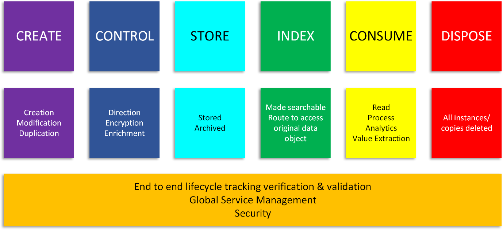
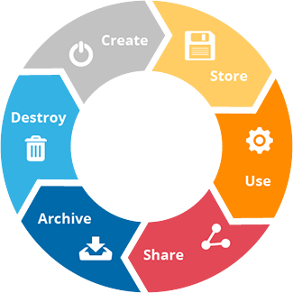
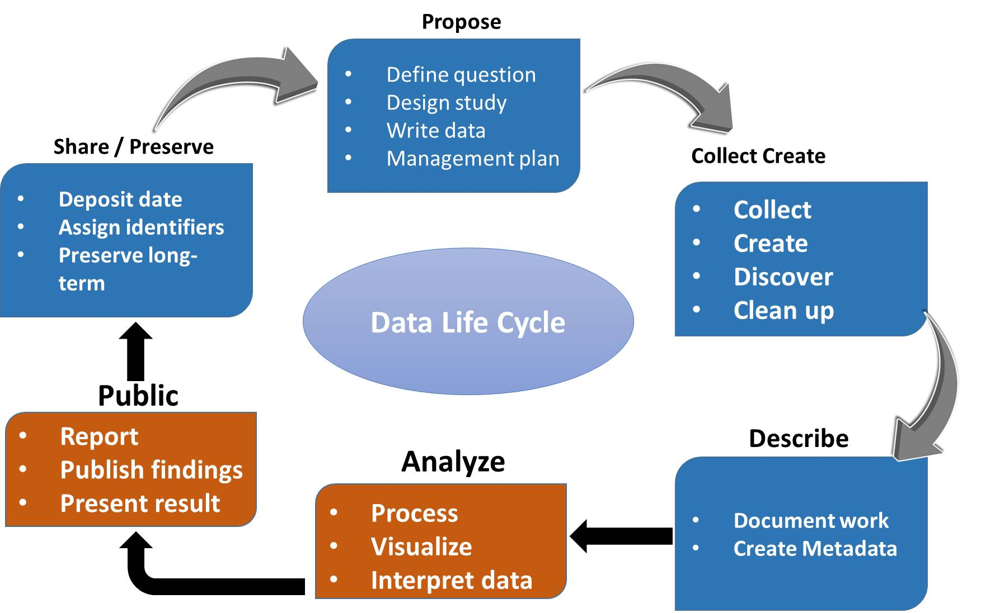

Date: 6 October 2018

Author: Michael McGrath

Reviewers: TBD

Version History
===============

V0.0 First draft, not for review

List of figures
===============

[Figure 1 Original Data Lifecycle Model (ODLM) 6](#_Toc526629157)

[Figure 2 DLM as presented by Lenhardt et al., 2014 8](#_Toc526629158)

[Figure 3 DLM as presented by Spirion 10](#_Toc526629159)

[Figure 4 ITTStar DLM 11](#_Toc526629160)

List of Tables
==============

[Table 1 ODLM mapped to Texas A&M Model 7](#_Toc526625514)

[Table 2 ODLM Mapped to RAMP Model 8](#_Toc526625515)

[Table 3 ODLM Mapped to Bloomberg Model 9](#_Toc526625516)

[Table 4 ODLM Mapped to Spirion Model 10](#_Toc526625517)

[Table 5 ODLM Mapped to ITTStar Model 11](#_Toc526625518)

Introduction
============

This paper is the output from the first Seahorse project. The goal of this
project is to define a working data. This paper describes the first Seahorse
project. The goal of this project is to define a working data lifecycle model
(DLM) that is practical in use and is as complete as possible. The DLM is based
of the Initial data lifecycle model, described below.

The growing role of data.
-------------------------

The growth in data is exceptional. While estimated of just how much data exists
vary all estimates show the same trend, exponential growth. Khoso (Khoso,
2016)estimates that data in 2016 totalled around 4.4 Zetabytes[^1] and that that
would grow to ten times that by 2020. Even email is growing by over 4% per year
(Radicati & Hoang, 2017). In tandem with the growth in data there is a
corresponding growth in storage required to persist that data. Additionally, we
see that the majority of that data is in unstructured forms; Khoso (Khoso, 2016)
estimates that about 90% of data created is unstructured, this view is supported
by practitioners (V Cloud News, 2015) who also asserted that 90% has been
created in the last year.

[^1]: The **zettabyte** is a multiple of the
unit [byte](https://en.wikipedia.org/wiki/Byte) for [digital
information](https://en.wikipedia.org/wiki/Computer_data_storage).
The [prefix](https://en.wikipedia.org/wiki/SI_prefix) [zetta](https://en.wikipedia.org/wiki/Zetta-) indicates
multiplication by the seventh power of 1000 or 1021 in the [International System
of Units](https://en.wikipedia.org/wiki/International_System_of_Units) (SI). A
zettabyte is one sextillion bytes. The unit symbol is **ZB**. 1 ZB
= 10007bytes = 1021bytes = 1000000000000000000000bytes.

    A related unit,
    the [zebibyte](https://en.wikipedia.org/wiki/Zebibyte) (ZiB), using
    a [binary prefix](https://en.wikipedia.org/wiki/Binary_prefix), is equal
    to 10247 (=270) bytes (approximately 1.181 ZB).(Source:
    <https://en.wikipedia.org/wiki/Zettabyte>)

There is also great value to this data, for example a report by focusing on data
in the automotive industry suggests that *“The expected growth of the value pool
from car data and shared mobility could add up to more than USD 1.5 trillion by
2030”* (Balasubramanian et al., 2016) and that this data used in AI *“… could
potentially deliver additional economic output of around \$13 trillion by 2030,
boosting global GDP by about 1.2 percent a year”* (“Modeling the global economic
impact of AI \| McKinsey,” n.d.).

In addition, some practitioners have reported other problems most notably that
there are no common data formats, little metadata and little interoperability
because the systems exist in independent and distinct systems (Sohn, 2017). It
is even asserted that these issues place such a financial burden on the health
industry as to be a noteworthy contributor to rising costs (Wang, Kung, & Byrd,
2018).

The DLM is important because it will provide the basis for the next project
which will describe an objective method and model to identify the total
lifecycle cost and value of data.

The goal of this project is to define a robust data lifecycle model (DLM) for
future research to be based upon. In addition, the goal of the DLM is to

*“The goal of a data management lifecycle is to ensure that … data are collected
with enough rigor to support the intended use, to support basic data management,
to enable reuse and repurposing of the data, and to allow for the eventual
long-term preservation and management of the data.”* (Lenhardt, Ahalt, Blanton,
Christopherson, & Idaszak, 2014)

Methodology
-----------

The method used is simple. A search of documented DLMs was performed and where
there were gaps or differences identified these were evaluated and the original
DLM was modified or not, accordingly.

Initial data lifecycle model
============================

Figure 1 Original Data Lifecycle Model (ODLM)

Documentation reviewed
======================

This section describes the literature reviewed. The definition of literature is
wider than the “usual” so as to include practitioner models which are often
found published in books or web pages. The goal of this project to create a
complete model for the data lifecycle which is robust enough to be applicable in
any circumstance. Some of the models examined here such as the DCC (Higgins,
2008) are designed to cover specific purposes and therefore have too narrow a
focus for the purposes of this research. That said these are still examined
because there may be elements within them that are useful additions to the
original model.

Though based on the transport sector the Texas A&M Transportation Institute
(Miller, Miller, Moran, & Dai, 2018) identifies seven major stages in the data
lifecycle this model has a number of differences from the original model. The
most significant are it separates storage from archiving, this is something that
other models do also. However, in the model we keep these together for a number
of reasons, the two most significant are that firstly archival storage, even
compliant storage such as 17a-4 (FINRA, 2014; “Regulatory Notice 17-18 Guidance
on Social Networking Websites and Business Communications,” 2017) storage is
still nonetheless storage. The second reason is that as the cost and capability
of storage improves in line with “Moore’s Law” (Moore, 2007) we see a growing to
consume data “in place” from the archive. Thus, over time we see in our business
this trend emerging. This is obviously an ontological position of the author and
his colleagues at this juncture.

These stages can be broadly mapped to the original model as follows:

Table 1 ODLM mapped to Texas A&M Model

| **Original Model** | **Texas A&M model**                    |
|--------------------|----------------------------------------|
| Create             |                                        |
| Control            | Collection Process                     |
| Store              | Store & Secure[^2]                     |
| Index              |                                        |
| Consume            | Use Share and communicate              |
| Dispose            | Destroy or re-use (concurrent phases). |

[^2]: Secure may imply encryption. In the original model this is part of the
previous step

Archive

They also explore other related aspects of data lifecycle management:

-   Purpose and value

-   Privacy

-   Data ownership

-   Liability

-   Public perception

-   Security

-   Standards and Data Quality

These topics are out of scope for this project, but they will be examined in
later research.

A similar DLM is found in a description of the Research Data Management Platform
(RDMP) (Nind et al., 2018) which is a longitudinal research dataset. They found
similar stages to the ODM, which are Create, Process, Analyse, Presenting, Give
access (reuse). These map fairly closely as can be seen in the table, below:

Table 2 ODLM Mapped to RAMP Model

| **Original Model** | **RDMP Model**         |
|--------------------|------------------------|
| Create             | Create                 |
| Control            | Process                |
| Store              |                        |
| Index              |                        |
| Consume            | Presenting Give access |
| Dispose            |                        |

In a web publication entitled “Data Management Lifecycle and Software Lifecycle
Management in the Context of Conducting Science” (Lenhardt et al., 2014)
published an DLM with some interesting additional features. The model is shown
below:

Figure 2 DLM as presented by Lenhardt et al., 2014

This model call for DLM to have additional elements of assure and describe.
Assure is part of the ODLM as the end to end lifecycle verification and
validation. Describe exists also as enrichment but will be added going forward.

The final DLM related paper that was reviewed was a review of eight models by
Alex Ball (Ball, 2012). In it he reviews eight DLMs which are specifically
focused on scientific data and as such display elements that are specific to
that purpose and so tend to specificity that is too granular for our purpose.
That said there are some noteworthy element so sider. In his paper he examined:

1.  DCC Curation Lifecycle

2.  I2S2 Idealized Scientific Research Activity Lifecycle Model

3.  DDI Combined Life Cycle Model

4.  ANDS Data Sharing Verbs

5.  DataONE Data Lifecycle

6.  UK Data Archive Data Lifecycle

7.  Research360 Institutional Research Lifecycle

8.  Capability Maturity Model for Scientific Data Management

From these I found the Data Documentation Initiative (DDI) (“Data Documentation
Initiative,” n.d.) lifecycle. Like others, it is limited for our purposes
because of its focus on surveys. It is useful as a subset of a DLM because of
its incorporation of reuse and different versions. In the end I decided to take
view that each item of data has its own lifecycle and thus when data is modified
or copied it is starting a new life cycle.

The UK Data Archive Data Lifecycle (UK Data Service, n.d.) provided very useful
definitions which have been incorporated into the definitions of the modified
model described in the following cycle.

Two practitioner developed models of note are presented by Bloomberg (Bloomberg
Professional Services, 2015), Spirion (Spirion, n.d.) and ITTStar (ITT Star,
2018).

Bloomberg’s model is composed of seven steps which can be mapped

Table 3 ODLM Mapped to Bloomberg Model

| **Original Model** | **Bloomberg model**                        |
|--------------------|--------------------------------------------|
| Create             |                                            |
| Control            | Data Maintenance Data Capture              |
| Store              | Data Archival                              |
| Index              | Data Synthesis Data Usage Data Publication |
| Consume            |                                            |
| Dispose            | Data purging                               |

The model put forward by Spirion is again very similar. It is shown in the
figure, below. Whereas the ODLM has consumption, the act of using and therefore
deriving value from the data, they describe it a share which opens up the wider
possibility of publishing or sharing.

Figure DLM as presented by Spirion

This maps closely to the ODLM which we started with, which can be seen in the
following table:

Table ODLM Mapped to Spirion Model

| **Original Model** | **Spirion model** |
|--------------------|-------------------|
| Create             | Create            |
| Control            |                   |
| Store              | Store Archive     |
| Index              |                   |
| Consume            | Share             |
| Dispose            | Destroy           |

The final practitioner model examined was the one produced by ITTStars. It
highlights the useful features examining the need for data clean-up within the
control phase which the ODLM does not present. Again, like others it also draws
attention to data description and analysis. They, ITTStars, present it using the
following figure:

Figure ITTStar DLM

For comparison with the ODLM we can see a high degree of overlap, indicated by
the table below:

Table ODLM Mapped to ITTStar Model

| **Original Model** | **ITTStar model**             |
|--------------------|-------------------------------|
|                    | Purpose                       |
| Create             | Collect Create Describe       |
| Control            |                               |
| Store              | Analyze Public Share/Preserve |
| Index              |                               |
| Consume            |                               |
| Dispose            |                               |

Changes to the data lifecycle model arising from the literature
===============================================================

This section describes the changes to the data model resulting from the
literature review and acknowledges the source of those modifications. The
following section “Modified model” describes the modified data model and
contains the definition of each stage and corresponding activities in that
phase.

Ha

Additions Reuse describe assure

Description and (management of) Representation Information. The creation,
collection, preservation and maintenance of sufficient metadata to enable the
data to be used and re-used for as long as they have value to justify continued
curation.

Preservation planning is described as “Strategies, policies and procedures for
all curation actions” (Ball, 2012, pg. 3)this and the corresponding mechanism
such as a preservation and retention system and policies is added to the
lifecycle component at the base of the DLM in addition to the other components
such as end-to-end reconciliation.

Modified model
==============

Conclusion
==========

Appendix
========

Bibliography
============

Balasubramanian, J., Belker, S., Chauhan, S., Colombo, T., Hansson, F.,
Inampudi, S., … Kässer, M. (2016). Car data: paving the way to value-creating
mobility. *McKinsey & Company*, (March). Retrieved from
https://www.mckinsey.com/\~/media/McKinsey/Industries/Automotive and
Assembly/Our Insights/Creating value from car data/Creating value from car
data.ashx

Ball, A. (2012). Review of Data Management Lifecycle Models., 15. Retrieved from
https://purehost.bath.ac.uk/ws/portalfiles/portal/206543/redm1rep120110ab10.pdf

Bloomberg Professional Services. (2015). 7 phases of a data life cycle \|
Bloomberg Professional Services. Retrieved July 16, 2018, from
https://www.bloomberg.com/professional/blog/7-phases-of-a-data-life-cycle/

Data Documentation Initiative. (n.d.). Retrieved October 6, 2018, from
http://www.ddialliance.org/

FINRA. (2014). *Records to be preserved by certain exchange members, brokers and
dealers SEA Rule 17a-4*. Retrieved from
https://www.finra.org/sites/default/files/SEA.Rule_.17a-4.Interpretations_0_0.pdf

Higgins, S. (2008). The DCC Curation Lifecycle Model. *International Journal of
Digital Curation*, *3*(1), 134–140. https://doi.org/10.2218/ijdc.v3i1.48

ITT Star. (2018). IT Datamanagement \| ITTStar Consulting LLC. Retrieved October
6, 2018, from http://www.ittstar.com/it_data.html

Khoso, M. (2016). How Much Data is Produced Every Day? Retrieved August 20,
2017, from
http://www.northeastern.edu/levelblog/2016/05/13/how-much-data-produced-every-day/

Lenhardt, W., Ahalt, S., Blanton, B., Christopherson, L., & Idaszak, R. (2014).
Data Management Lifecycle and Software Lifecycle Management in the Context of
Conducting Science. *Journal of Open Research Software*, *2*(1), e15.
https://doi.org/10.5334/jors.ax

Miller, K., Miller, M., Moran, M., & Dai, B. (2018). Data Management Life Cycle,
Final report. Retrieved from
https://static.tti.tamu.edu/tti.tamu.edu/documents/PRC-17-84-F.pdf

Modeling the global economic impact of AI \| McKinsey. (n.d.). Retrieved
September 24, 2018, from
https://www.mckinsey.com/featured-insights/artificial-intelligence/notes-from-the-ai-frontier-modeling-the-impact-of-ai-on-the-world-economy

Moore, G. E. (2007). David C. Brock(Editor). Understanding Moore’s Law: Four
Decades of Innovation . x + 160 pp., illus., notes, index. Philadelphia:
Chemical Heritage Foundation, 2006. \$12 (paper). *Isis*, *98*(4), 887–887.
https://doi.org/10.1086/529346

Nind, T., Galloway, J., McAllister, G., Scobbie, D., Bonney, W., Hall, C., …
Jefferson, E. (2018, July 1). The research data management platform (RDMP): A
novel, process driven, open-source tool for the management of longitudinal
cohorts of clinical data. *GigaScience*. Oxford University Press.
https://doi.org/10.1093/gigascience/giy060

Radicati, S., & Hoang, Q. (2017). *Email Statistics Report, 2017-2021*. *Email
Statistics report, 2017-2021 - Executive Summary* (Vol. 44). London. Retrieved
from http://www.radicati.com

Regulatory Notice 17-18 Guidance on Social Networking Websites and Business
Communications. (2017). *FINRA Regulatory Noticees*.

Sohn, A. (2017). You Want to do What With Your Data? Retrieved September 8,
2018, from
https://bigdata.cioreview.com/cxoinsight/you-want-to-do-what-with-your-data-nid-27091-cid-15.html

Spirion. (n.d.). Data Lifecycle Management (DLM) \| Spirion. Retrieved October
6, 2018, from https://www.spirion.com/data-lifecycle-management/

UK Data Service. (n.d.). UK Data Service » Research data lifestyle. Retrieved
October 6, 2018, from https://www.ukdataservice.ac.uk/manage-data/lifecycle

V Cloud News. (2015). Every day Big Data Statistics - 2.5 Quintillion Bytes of
Data Created Daily. Retrieved August 20, 2017, from
http://www.vcloudnews.com/every-day-big-data-statistics-2-5-quintillion-bytes-of-data-created-daily/

Wang, Y., Kung, L. A., & Byrd, T. A. (2018). Big data analytics: Understanding
its capabilities and potential benefits for healthcare organizations.
*Technological Forecasting and Social Change*, *126*, 3–13.
https://doi.org/10.1016/j.techfore.2015.12.019
